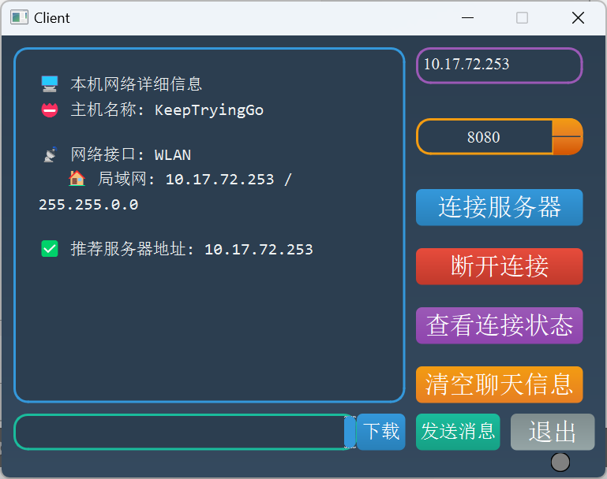
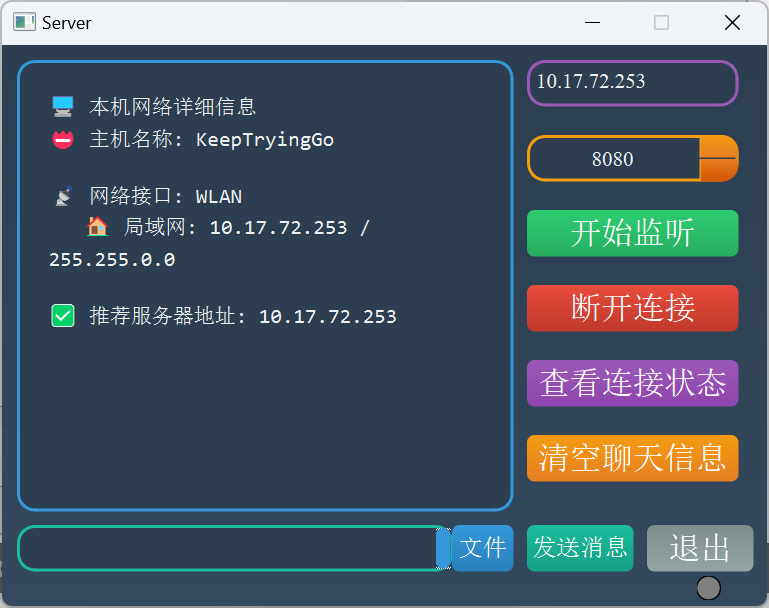
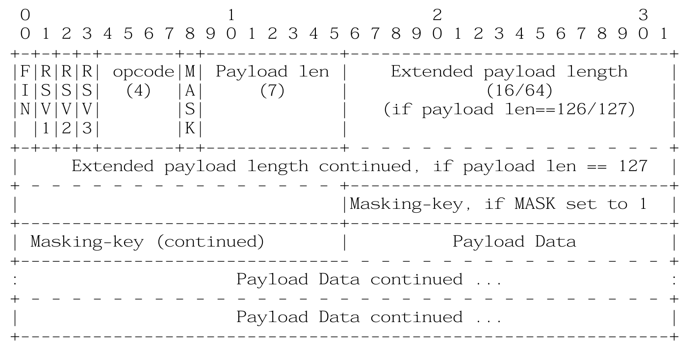

基于QT 6.6.0的WebSocket使用
=================


客户端页面
-------------------------



服务端页面
-------------------------


操作流程
------------------------
* 第一步：分别启动服务端和客户端，加载CSS文件渲染画面和看到聊天框中加载的主机信息（右下角的灯还是暗的）
* 第二步：点击服务端“监听”按钮（服务端右下角的灯开始黄颜色）
* 第三步：客户端点击“连接服务器”按钮（客户端右下角的灯开始黄颜色）
* 第四步：等待客户端和服务端连接成功（服务端和客户端右下角的灯开始绿色）
* 第五步：客户端和服务端分别可以向对方发送消息
* 第六步：客户端和服务端可以查看连接状况；
* 第七步：可以选择断开连接
* 第八步：可以清空聊天信息
* 第九步：服务端可以点击“发送文件”按钮，客户端接收完成可以点击“下载”按钮选择保存文件位置


客户端和服务端整体通信流程
----------------------------
```
+-------------------+                         +-------------------+
|      Client       |                         |      Server       |
+-------------------+                         +-------------------+
         |                                           |
         | 1. TCP连接 (WS握手)                        |
         |------------------------------------------>|
         |                                           |
         | 2. WebSocket连接建立成功                   |
         |<------------------------------------------|
         |                                           |
         | 3. 发送文本消息 "客户端已连接!"             |
         |------------------------------------------>|
         |                                           |
         | 4. 服务端响应文本消息                       |
         |<------------------------------------------|
         |                                           |
         | 5. 服务端点击"发送文件"按钮                 |
         |    服务端准备文件并发送FILE_HEADER          |
         |<------------------------------------------|
         | (包含文件名和大小)                          |
         |                                           |
         | 6. 客户端发送FILE_ACK确认                  |
         |------------------------------------------>|
         |                                           |
         | 7. 服务端开始分块发送FILE_CHUNK             |
         |<------------------------------------------|
         | (循环发送直到文件完成)                      |
         |                                           |
         | 8. 客户端对每个块回复FILE_CHUNK_ACK        |
         |------------------------------------------>|
         |                                           |
         | 9. 文件传输完成                            |
         |                                           |
         | 10. 客户端点击"下载"保存文件                |
         |                                           |
         | 11. 任意一方可发送文本消息                  |
         |<----------------------------------------->|
         |                                           |
         | 12. 断开连接                               |
         |<----------------------------------------->|
         |                                           |
```


websocket协议
---------------------
WebSocket是一种在单个TCP连接上进行全双工通信的协议。WebSocket通信协议于2011年被IETF定为标准RFC 6455，并由RFC7936补充规范。WebSocket API也被W3C定为标准。

### websocket协议格式


* FIN（1 bit）​​：指示是否为消息的最后一个片段；
* ​RSV1, RSV2, RSV3（各1 bit）​​：保留位，用于扩展，默认为0；
* ​Opcode（4 bits）​​：定义帧的类型（如文本、二进制、控制帧等）；
* ​Mask（1 bit）​​：指示负载是否被掩码（客户端到服务器的帧必须掩码）；
* ​Payload length（7/7+16/7+64 bits）​​：负载长度（可能扩展）;
* ​​Masking-key（0或4字节）​​：如果Mask位为1，则包含32位掩码键；
* ​​Payload data​​：实际传输的数据（可能包含扩展数据和应用数据）。

[TCP协议，HTTP协议，WebSocket协议总结以及QT 6.6.0 中使用WebSocket协议进行客户端和服务端的通信（C/C++）](https://blog.csdn.net/Keep_Trying_Go/article/details/151568114)

[websocket文档对应的中文翻译](https://blog.csdn.net/Mr_Sunqq/article/details/126904377)

https://subingwen.cn/project/websocket/#2-2-4-%E5%85%B3%E9%97%AD%E8%BF%9E%E6%8E%A5


​
漂亮的图标网站
====================
https://unicode.org/emoji/charts/full-emoji-list.html

https://getemoji.com/

https://emojipedia.org/emoji-mashup/twitter/twemoji-14.0?a=%F0%9F%98%80&b=%F0%9F%98%86

参考链接
====================
https://baike.baidu.com/item/WebSocket/1953845

https://doc.qt.io/qt-6/qwebsocketserver.html

https://blog.csdn.net/gitblog_06785/article/details/147667884

[websocket文档对应的中文翻译](https://blog.csdn.net/Mr_Sunqq/article/details/126904377)

https://subingwen.cn/project/websocket/#2-2-4-%E5%85%B3%E9%97%AD%E8%BF%9E%E6%8E%A5

[RFC6455文档](https://www.rfc-editor.org/search/rfc_search_detail.php)
https://websocket.xiniushu.com/data-framing

QT应用案例汇总
=====================
https://mydreamambitious.blog.csdn.net/article/details/142690011?spm=1011.2415.3001.5331

​

